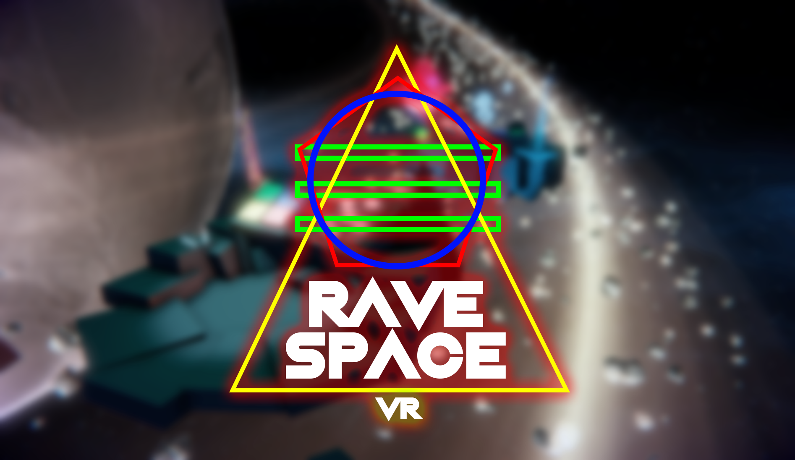
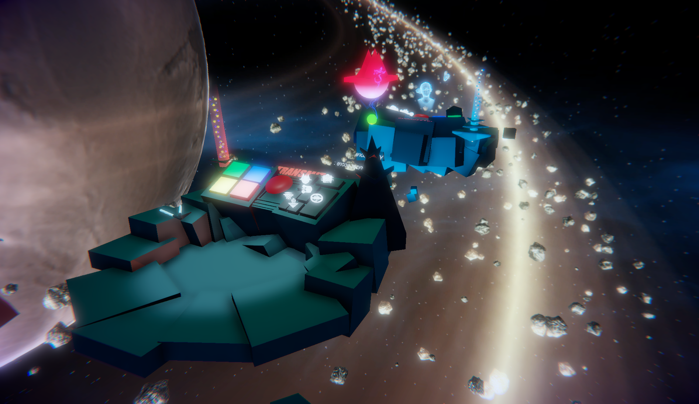

# Rave Space VR

In this game you play an employee of the Intergalactic Translation Agency and you will have to fight against other employees in order to get the title of "Employee Of The Month". The goal is to translate some aliens symbols and transmit the translation to other planets. The agency likes to play some 80's electro sounds for its employees to give them good work rhythms and assists them in this repetitive task. Will you become the "Employee of the Month" ? This game is a VR Social Game supported by Oculus only. When connected, please wait for your challenger... The game will start automatically after a countdown when the second player will be connected. You can play with light sticks to hang out during the connection time...

### Diversifiers: 
ART - Stranger Things  
CODE - So Sociable

### Platforms: 
MS Windows, Virtual Reality platform

### Tools And Technologies: 
.Net, Unity (any product), Virtual reality head mount display (Oculus Rift, HTC Vive, etc.)

### Technology Notes: 
Photon Engine for Network API Connection Some Free Unity assets

### Installation Instructions: 
Connect your Oculus device and launch Rave Space VR.exe

### Credits: 
Julien Chambriard // 2D/3D Artist @Ju_Chambriard  
Loïs Aubrée // Programming @_LoisAubree

<a href="https://globalgamejam.org/2018/games/rave-space-vr">Download it on globalgamejam.org</a>
